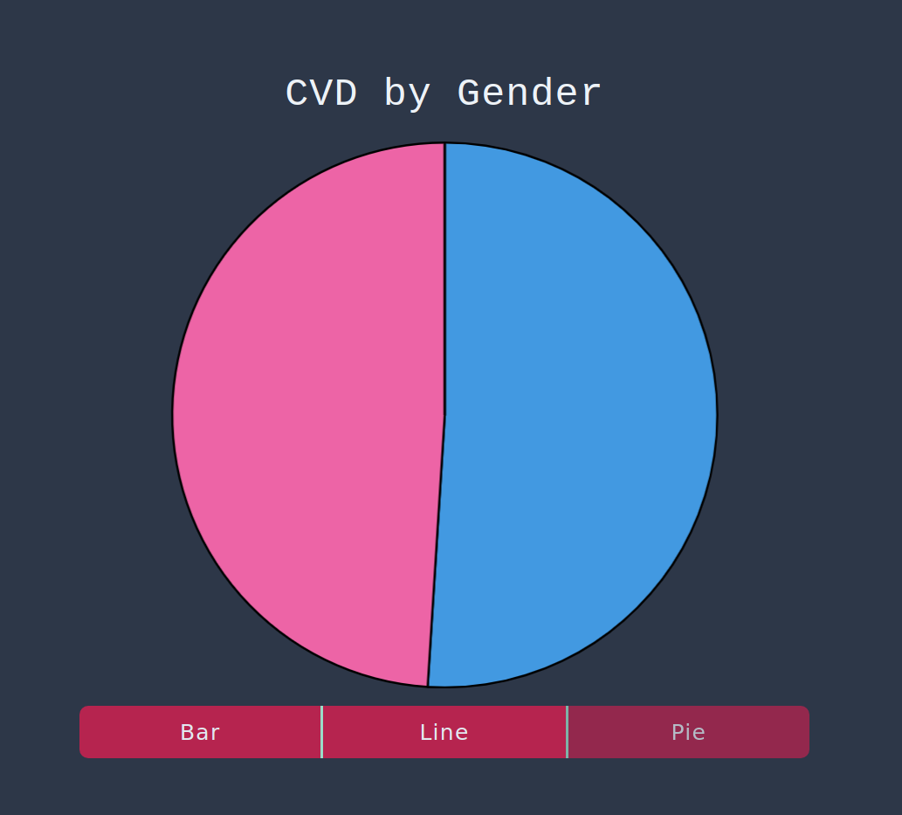

# Medical Report Generation



## Project Details

The idea is to make visuals and create predictions based on an existing dataset. The theme of this project is Medical Report Generation, specifically Cardiovascular diseases (CVD). As far as data visualization goes, it concerns mostly creating charts using different factors (age, bmi, gender) to showcase the risk of getting CVD. A [data set from Kaggle](https://www.kaggle.com/bhadaneeraj/cardio-vascular-disease-detection) has already been imported.

## Core items TODO

* Making specific data structures based on the dataset (e.g percentage of males, percentage of people who are > X years, etc)
* Using the data structures created to allow the end user to choose the factor by which he/she wants to have visualizations
* Creating algorithms for making predictions based on the existing data set
* Creating a section to allow a user to input details and return the risk of him/her to be diagnosed with CVD at a later stage of his/her life

Of course, anyone is free to work on the project! Check the [Issues](https://github.com/EdgeKing810/medical-report-generation/issues) section to pick a task to work on. Please post a comment when you decide to work on one. Further steps include forking the project, cloning your newly created fork, checking out to a new branch, making changes locally and submitting a pull request. If the changes are satisfactory, it will be merged here. You shall find more resources on the steps just mentionned by learning how to use git and GitHub, and by making use of Good ol' Google.

## Technical Details

For running the project on your machine locally, either for testing or development purposes, you should already have [NodeJS](https://nodejs.org/en/) and [npm](https://www.npmjs.com) already installed and working. If that is not the case, it should be easy enough to install with some research.

```bash
git clone https://github.com/EdgeKing810/medical-report-generation
cd medical-report-generation
npm i
npm start
```

After installing dependencies and an `npm start`, the interface/site should be accessible on http://localhost:3000.
